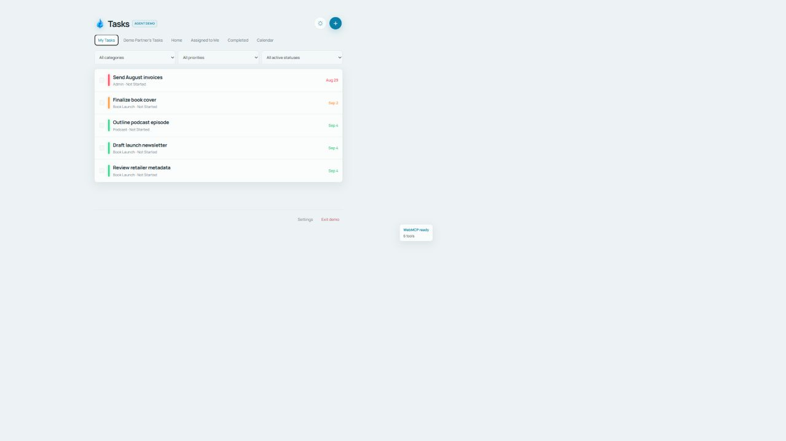

# Open Tasks

**An existing task manager transformed into an agent-native shared workspace with WebMCP.** The human works visually, the agent acts structurally, and both operate on the same live application state.

[Live demo](https://yanely-jordan-task-hub.vercel.app) · [Judge quickstart](docs/JUDGE_QUICKSTART.md) · [Demo script](docs/FINAL_DEMO_SCRIPT.md)

## Try it in 60 seconds

1. Open the [live app](https://yanely-jordan-task-hub.vercel.app) in ChatGPT's WebMCP-capable in-app browser.
2. Choose **Open demo workspace**. No login is required and the seeded workspace is isolated from private Firebase data.
3. Ask: **“Add ‘Record launch trailer’ for Wednesday and make it high priority.”**
4. Select two task cards, then ask: **“Move these to Friday, but leave the launch trailer where it is.”**

Add `?webmcpDebug=1` to show tool availability, registered tool count, and the last invocation/result.



## Why WebMCP?

Tasks constantly emerge while people brainstorm, research, and plan with an agent. Without WebMCP, transferring them into an existing task system means leaving the conversation, navigating forms, and copying information—or trusting brittle DOM automation.

Open Tasks exposes validated operations, stable task IDs, the current view and filters, and the human's selected cards. The agent can understand “these tasks,” perform an exact batch change, and update the visible app immediately. WebMCP is the collaboration layer, not an AI feature bolted onto a todo list.

## Six WebMCP tools

| Tool | What it gives the human and agent |
| --- | --- |
| `get_task_context` | Current view, filters, member, categories, and selected stable task IDs. |
| `list_tasks` | Precise retrieval by status, dates, overdue state, priority, category, text, or IDs. |
| `create_task` | Validated creation through the existing task model. |
| `update_task` | Explicit-field updates to one known task. |
| `complete_task` | Reliable completion using existing history and recurring-task behavior. |
| `batch_update_tasks` | Deliberate updates to as many as 20 validated task IDs. |

The integration uses the current asynchronous `document.modelContext.registerTool(tool, { signal })` API. Existing task functions remain the source of truth, and normal React/Firebase synchronization makes agent actions visible without refreshing.

## Human + agent workflow

**Human selects or filters visually → agent reads page-aware context → WebMCP invokes a narrow tool → existing task service mutates state → UI updates live.**

The human can point with the interface while the agent handles language, reasoning, and repetitive structured changes.

## Safety architecture

- The public demo is seeded, origin-scoped browser storage and never accesses the owners' Firebase household.
- Signed-in data retains Firebase Authentication, household-scoped Firestore rules, and real-time listeners.
- WebMCP exposes no delete operation.
- Mutations reject unknown IDs, invalid enums/dates, empty patches, duplicates, and batches over 20 tasks.
- `.env*` is ignored except the empty-key `.env.example`; no credentials are committed.

## Run locally

```powershell
npm install
Copy-Item .env.example .env.local
npm run dev
```

The no-login demo works without Firebase configuration. For the private authenticated workspace, populate the `VITE_FIREBASE_*` variables, create approved `members/{uid}` records, and deploy the included Firestore rules/indexes.

```powershell
npm run lint
npm test
npm run test:e2e
npm run test:rules
npm run build
```

## Stack

React 19, Vite 8, Firebase Authentication, Firestore real-time listeners, and Vercel. The WebMCP adapter is `src/lib/webmcp.js`; framework-independent schemas and validation are in `src/lib/webmcpCore.js`; the isolated judge workspace is `src/lib/demoWorkspace.js`.

MIT licensed.
